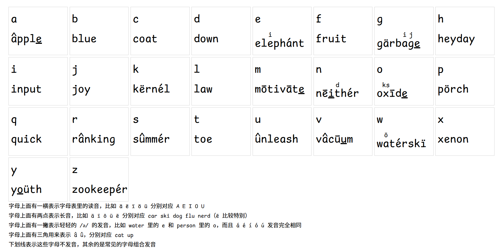
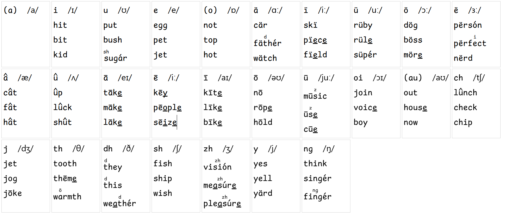
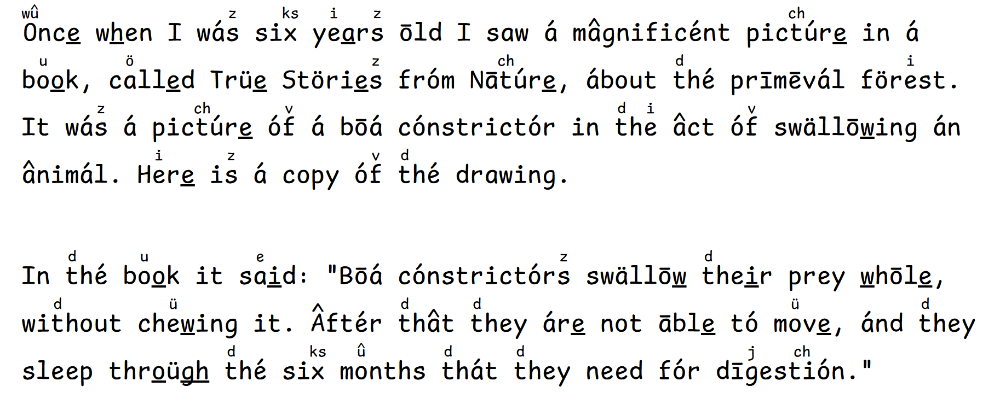

# English Gana

There are lots of words in English which are spelled in a way that doesn't reflect its pronunciation.

Some words are pronouced differently according to parts of speech, and some might have strong form and weak form, which adds more complexity to the English language.

Therefore I want to add some symbols on the top of the word to help memorize the pronunciation as well as the spelling.

## Demo

## Special Thanks

TODO
